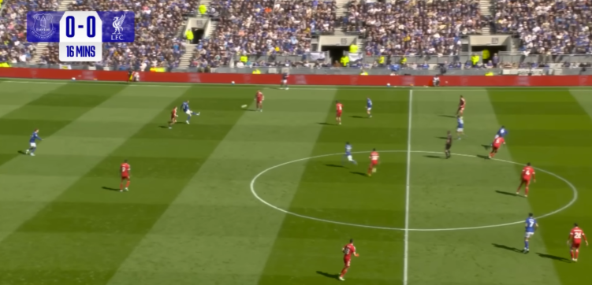
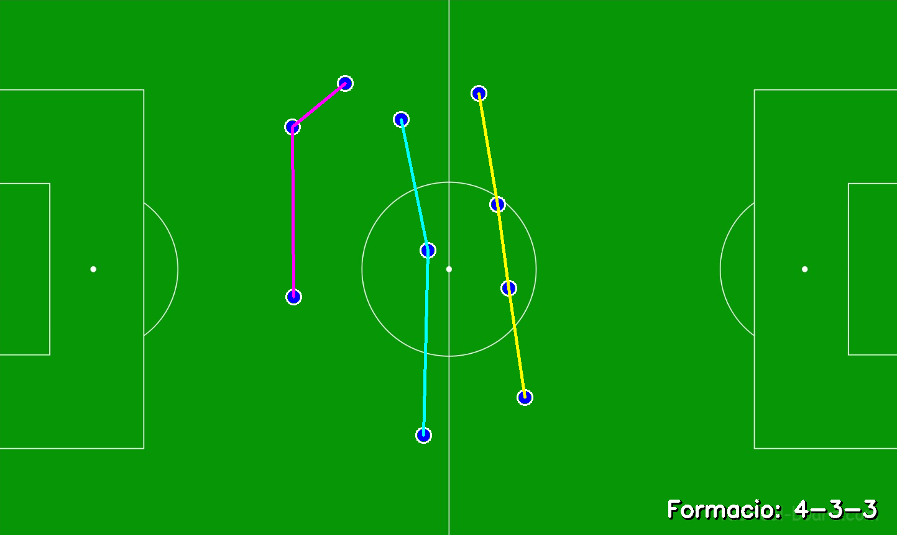
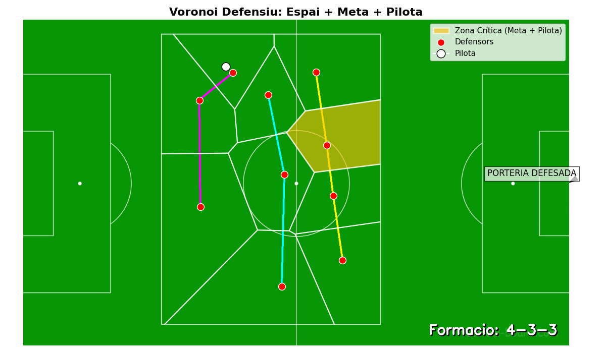

# Football Player Detection & Tactical Analysis

Computer vision project for detecting football players from broadcast images, projecting their positions onto a 2D tactical pitch and analysing defensive formations and vulnerable spaces.

The system combines **YOLOv8x-seg**, **OpenCV**, **K-Means clustering**, **homography** and **Voronoi diagrams** to transform a television match frame into a more structured tactical representation.

## Overview

This project was developed as part of the **PSIV course** in the BSc in Data Engineering at Universitat Autònoma de Barcelona (UAB).

The main objective was to build a system capable of:

* detecting football players from broadcast images
* separating players into teams
* projecting player positions onto a top-down tactical pitch
* identifying defensive lines and formations
* analysing spatial vulnerabilities using Voronoi diagrams

The project evolved through several iterations before reaching a **hybrid computer vision + manual validation approach**.

## Project Pipeline

The final workflow consists of several stages.

### 1. Reference point selection

Four reference points are manually selected both on the broadcast image and on a tactical pitch template.

These correspondences are used to estimate a **homography matrix** and transform player coordinates from the camera perspective into a 2D tactical representation.

### 2. Player detection with YOLO

The system uses the pretrained **YOLOv8x-seg** model from Ultralytics to detect players in the original match frame.

Detected objects are represented using bounding boxes that allow the system to estimate the position of each player on the image.

### 3. Team classification

For each detected player, the image region inside the bounding box is analysed.

Grass-coloured pixels are filtered and the dominant remaining colour is extracted.

**K-Means clustering** is then applied to group players according to kit colour and approximately separate the two teams.

### 4. Manual validation

Real broadcast images contain several difficult cases, including:

* referees
* goalkeepers
* overlapping players
* strong shadows
* partially visible players
* incorrect team classification

Because of this, the system includes a manual correction interface where the user can:

* add a missing player
* remove an incorrect detection
* change a player's assigned team

This creates a hybrid approach where computer vision performs most of the detection while the user corrects exceptional cases.

### 5. Defensive team selection

The user selects one player belonging to the defending team.

The system then keeps the detected players associated with that team for the tactical analysis.

### 6. 2D pitch projection

The bottom centre of each player's bounding box is used as an approximation of the player's contact point with the pitch.

These points are transformed through the previously calculated homography and projected onto a tactical football pitch.

The resulting player coordinates can also be stored in JSON format for further processing.

### 7. Formation detection

Players are grouped into three longitudinal zones based on their projected positions:

* defence
* midfield
* attack

The system counts the number of players in each zone and generates an approximate tactical formation such as:

```text
4-4-2
4-3-3
5-4-1
```

Players belonging to the same tactical line are connected visually on the 2D pitch.

### 8. Voronoi spatial analysis

The final stage applies a **Voronoi diagram** to analyse the defensive structure.

Instead of analysing free space alone, the project combines three factors:

* distance from defensive players
* proximity to the defended goal
* proximity to the ball

A vulnerability score is calculated across the defensive area to highlight zones that may represent a greater tactical risk.

---

## Example

### Input broadcast frame



### Tactical representation



### Complete spatial analysis



The pipeline transforms an ordinary broadcast frame into a structured representation of the defensive formation and surrounding spatial risk.

## Technologies

* **Python**
* **Ultralytics YOLOv8x-seg**
* **OpenCV**
* **NumPy**
* **scikit-learn**
* **K-Means**
* **SciPy**
* **Matplotlib**
* **Homography / projective geometry**
* **Voronoi diagrams**
* **KDTree**
* **JSON**

## Repository Structure

```text
football-player-detection-tactical-analysis/
│
├── src/
│   ├── manual_tactical_analysis.py
│   └── player_detection_tactical_analysis.py
│
├── assets/
│   └── pitch-template.png
│
├── examples/
│   ├── input-match-frame.png
│   ├── tactical-analysis-result.png
│   └── complete-tactical-analysis-result.png
│
├── requirements.txt
├── .gitignore
└── README.md
```

### `manual_tactical_analysis.py`

Initial version of the system.

Players are manually selected in the broadcast image and projected onto the tactical pitch through homography.

This version was used as a baseline before introducing automatic player detection.

### `player_detection_tactical_analysis.py`

Final prototype integrating:

* YOLO player detection
* colour-based team clustering
* manual correction
* defensive team selection
* homography transformation
* tactical line detection
* formation estimation
* Voronoi-based spatial analysis

## Development Process

The project followed an iterative development process.

An initial objective was to automatically transform the entire television image into a top-down view and automatically detect field reference lines.

Several approaches were explored, including:

* perspective transformation
* vanishing-point estimation
* grass segmentation
* Canny edge detection
* Hough line transformation

These approaches did not provide sufficiently reliable results across real broadcast footage.

The project therefore pivoted towards a hybrid solution:

```text
Manual reference points
        ↓
YOLO player detection
        ↓
Team classification
        ↓
Manual correction
        ↓
Homography
        ↓
2D tactical representation
        ↓
Formation analysis
        ↓
Voronoi spatial analysis
```

This approach provided a more practical balance between automation and reliability.

## Evaluation

The automatic player detection stage was evaluated on **12 match images**.

Three types of manual intervention were measured:

* **Reassignment** — changing a player from one team to the other
* **Removal** — deleting an incorrect detection such as a referee or goalkeeper
* **Addition** — manually adding a player that was not detected

The results showed that:

* **75% of the images required at most 2 manual corrections**
* the **median was 1 correction per image**
* the overall mean was **2.17 corrections per image**

Two particularly difficult images acted as strong outliers.

Together, these two cases accounted for **17 of the 26 total corrections (65%)**, despite representing only 2 of the 12 evaluated images.

When excluding these two exceptional cases, the remaining 10 images required an average of approximately **0.9 corrections per image**.

These results suggest that the detector worked effectively in most standard situations, while performance degraded in more complex frames involving shadows, player accumulation or difficult visual conditions.

## My Contribution

This was an **academic team project with four members**.

My main contribution focused on the **player detection component**, including work with:

* Python
* YOLOv8x-seg / Ultralytics
* OpenCV
* player detection and localisation
* colour-based player analysis
* K-Means team separation
* integration of manual corrections into the detection workflow

The complete repository represents the work of the project team and includes additional components developed collaboratively as part of the final system.

## Limitations

The project was designed as an academic proof of concept rather than a production-ready football analytics platform.

Some important limitations are:

* pitch reference points must be selected manually
* player detections may require manual correction
* difficult lighting and player overlap can reduce detection quality
* the evaluation dataset contains only 12 images
* Voronoi-based vulnerability analysis was explored as a proof of concept and was not validated on a sufficiently large dataset to establish predictive performance

Despite these limitations, the project demonstrates how computer vision and spatial analysis can transform unstructured broadcast images into structured tactical information.

## Academic Context

**Project:** Defensive Formation Detection
**Degree:** BSc in Data Engineering
**University:** Universitat Autònoma de Barcelona (UAB)
**School:** Escola d'Enginyeria
**Project period:** April–May 2026
**Team size:** 4 students

## Requirements

The main Python dependencies are listed in:

```text
requirements.txt
```

The project uses a pretrained Ultralytics YOLO model. Model weight files are not stored in this repository.

## Notes

The code in this repository reflects the prototype developed during the academic project.

The main purpose of this repository is to document the project's **computer vision pipeline, tactical analysis methodology, experimentation process and results**.
